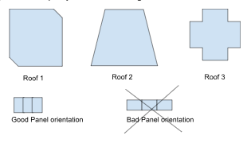

# Problem 2
We want to add a “Panel Placing Tool” (PPT) to the existing site selection tool. This PPT’s function would be to maximize the number of vertically placed panels that you can install on any roof shape. The panels are always the same size, shape, and vertically oriented.
Instructions: Explain step by step how you would fit and calculate the maximum amount of panels that can be placed on the selected area. What assumptions you would make and why. What other information would you need from the final user.

NOTE: we’re looking for a path to solve the problem, not the actual solution. There’s not one solution but many possibilities, and we’d be looking more at your approach on solving the challenge than the actual solution, so please be descriptive on how you got there

Example: The input you have is a figure selected like the ones below

[]

Response 
1. I would reduce the roof surface in order to obtain a regular shape as rectangle or a square.
2. then I would divide the lenght of the resultant surface between the size of a panel
3. the results should be the number of panels than you can install on the roof.

